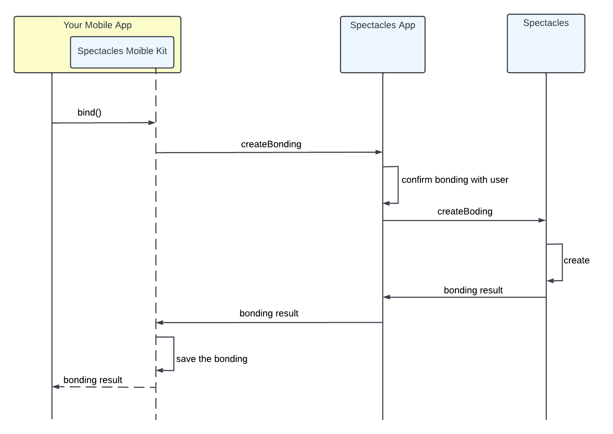
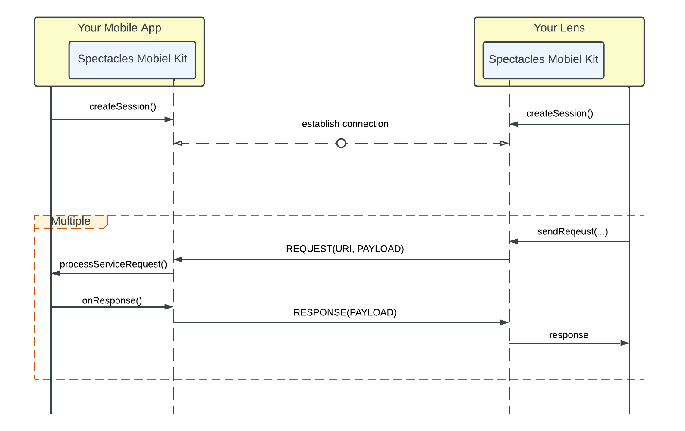
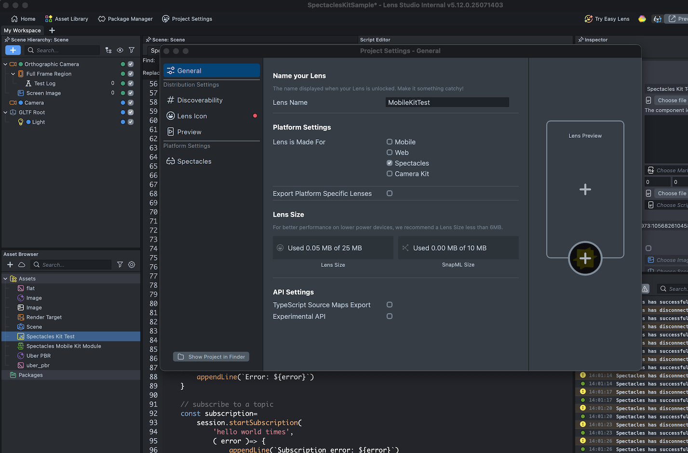
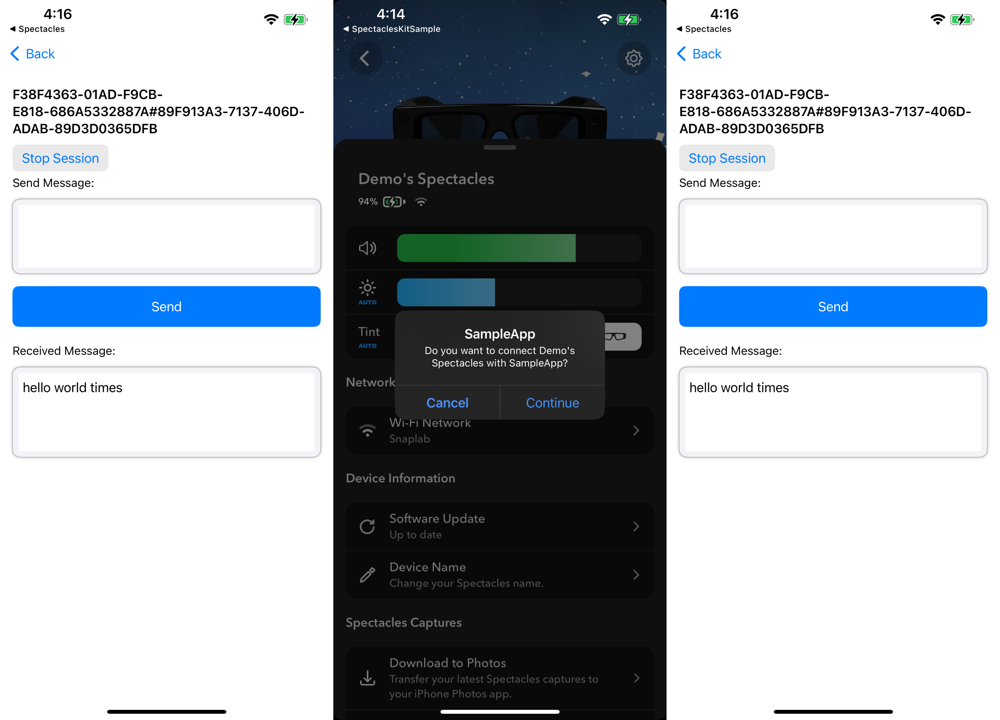
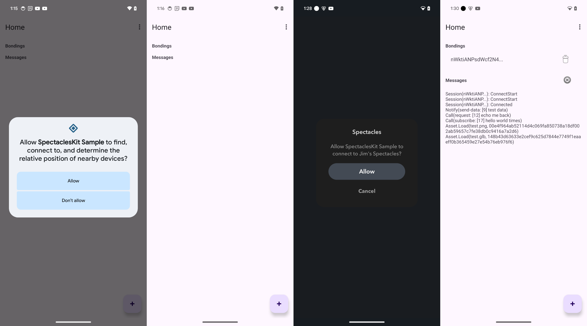
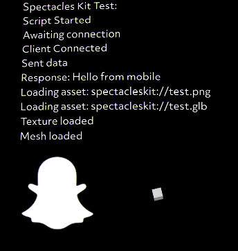

# Spectacles Mobile Kit

## Overview

Spectacles Mobile Kit is a SDK that enables seamless communication
between mobile applications and Lenses running on Spectacles via
Bluetooth Low Energy (BLE). It empowers creators to build rich,
interactive experiences that bridge mobile and Spectacles. Whether
you're developing Lenses that respond to mobile input or enhancing your
application with Spectacles integration, Spectacles Mobile Kit
simplifies connectivity and enables two-way communication, unlocking new
possibilities for dynamic, cross-device AR experiences.

## Getting Started

### Prerequisites

- Lens Studio v.5.15 or later

- Spectacles SnapOS v.5.64 or later

- Spectacles App v.0.64 or later

### How Spectacles Mobile Kit Works

#### Bonding

Before accessing any other functionality, a security bonding process
must be completed to establish a secure and trusted relationship between
your mobile application and the Lens running on Spectacles.

- Your mobile application initiates a bonding request.

- **Spectacles App** on the same device responds by prompting the user
  to grant access to your mobile application.

- Once permission is granted, **Spectacles App** coordinates with the
  **Spectacles** device to create a bond between your Lens and your
  mobile application.

- This bonding process only needs to be completed once and establishes
  the foundation for all future communication.

#### Session

Once bonding is complete, your mobile application and the Lens on
Spectacles can establish a secure communication session and begin
exchanging messages. Each session is both encrypted and authenticated
using the bonding credentials.

- Your mobile application and Lens both call createSession() to initiate
  the connection.

- Once a connection is established, the Lens can begin sending requests
  and events to your mobile application, which can respond accordingly.

- The Lens can begin subscribing to messages from the mobile application
  as well.

## Sample Project

### Setting Up Environment

1.  Install **Lens Studio**

2.  Install **Spectacles App** on your mobile device

3.  Pair your Spectacles with the **Spectacles App**

### Launch Sample Lens

1.  Open the [sample Lens](SpectaclesKitSample.esproj) project in Lens Studio.

2.  Go to the **Project Settings** and ensure the Lens Name is set to
    “MobileKitTest”

> 

3.  Click **Preview Lens** to install and launch the lens on your
    Spectacles.

### Launch Sample App

#### iOS

1.  Open the [iOS sample app](app/iOS/SpectaclesKitSample/) project in **Xcode 16** and run it on a
    physical iPhone device.

2.  Enable Bluetooth on your iPhone. Grant Bluetooth access when
    prompted.

3.  Tap **SpectaclesKit bind** in the sample app, this will open the
    **Spectacles App** for user consent.

4.  In the **Spectacles app**, wait for device connection, and tap
    **Continue** to return back to the sample app.

5.  In the sample app, tap the **binding result** cell to open the
    session details page.

6.  Tap **Start Session** button to connect to the sample Lens.

7.  Enter text in the text box and tap **Send**.  
    

#### Android

1.  Import the [Android sample app](app/Android/SpectaclesKitSample/) project using **Android Studio**.

2.  Launch the sample app and grant all required permissions. If you
    accidentally deny the permission request, manually enable
    permissions in your phone’s settings.

3.  Ensure the sample Lens is active on your Spectacles.

4.  For the first run, tap the "**+**" button at the bottom-right
    corner, which will redirect you to the **Spectacles App** for user
    consent.

5.  In the **Spectacles App**, tap the “Allow" button to return to the
    sample app.

6.  The sample app will connect to the Spectacles and respond to
    requests from the sample Lens.

> 

### View Result 

The sample lens will display the message sent from the sample app, along
with the requested image and mesh.

> 

## API Spec
- [Lens APIs](lens-api.md)
- [iOS APIs](ios-api.md)
- [Android APIs](android-api.md)

---

*Built with 👻 by the Spectacles team*
 

